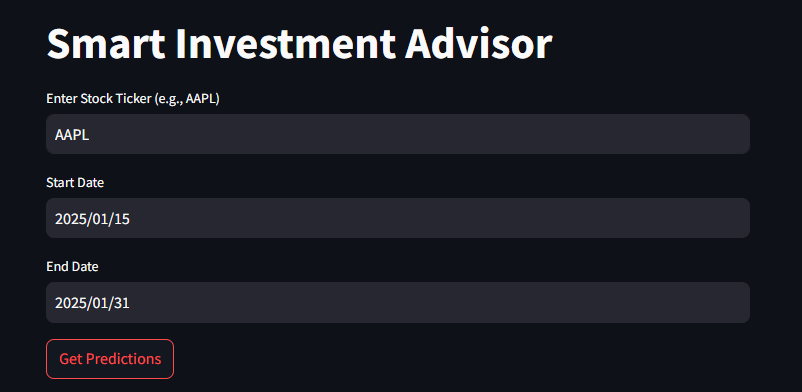
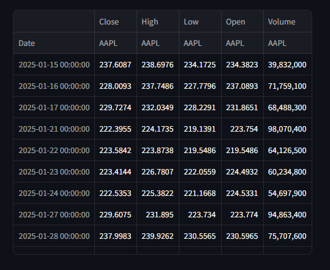

# 📈 Smart Investment Advisor

A machine learning-powered Streamlit web app that helps predict future stock prices using historical data. This project demonstrates how to use Random Forest Regression to analyze stock trends and make investment predictions.






## 🔍 Features

- ✅ Fetches real-time stock data using `yfinance`
- ✅ Computes technical indicators like High-Low % and Percentage Change
- ✅ Scales data and trains a **Random Forest Regressor**
- ✅ Predicts the **next 5 days** of stock closing prices
- ✅ Interactive visualization of predictions vs actual prices
- ✅ Fully built using **Streamlit** for web deployment

---

## 🛠️ Tech Stack

| Tool | Use |
|------|-----|
| Python | Programming Language |
| Streamlit | Web App Framework |
| yfinance | Fetching historical stock data |
| scikit-learn | Machine Learning |
| pandas, numpy | Data processing |
| matplotlib, seaborn | Data visualization |

---

## 🚀 How to Run Locally

1. Clone this repo:
   ```bash
   git clone https://github.com/Drylegend/Smart-Investment-Advisor.git
   cd Smart-Investment-Advisor

## Install dependencies: 
```
  pip install -r requirements.txt
```

## Run the app:
```
streamlit run smart_investment_advisor_app.py
```

